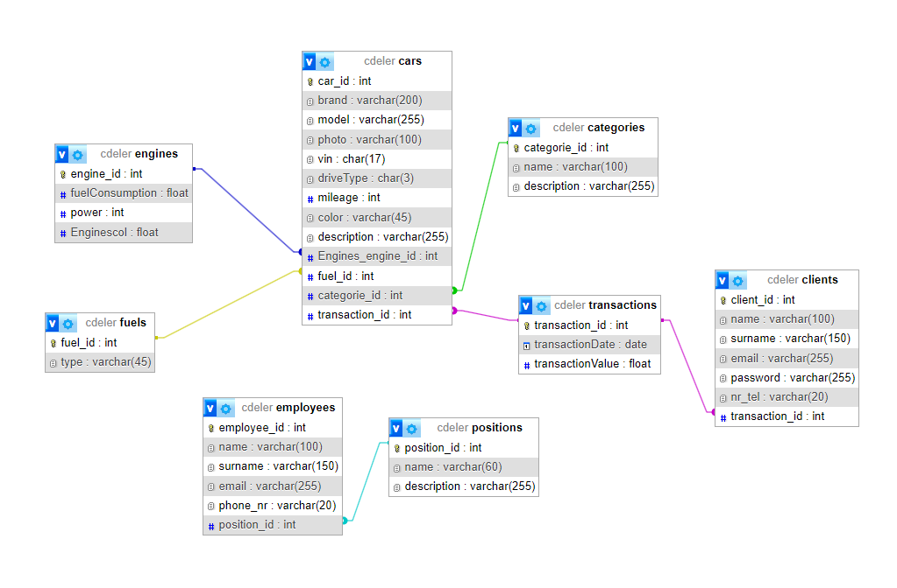

# CDeler

Autorzy:

- Kamil Przybylski 4D
- Wojciech Weiss 4D
- Jakub Wierzejewski 4D

## Opis aplikacji

Jesteśmy dealerem samochodowym oferującym zarówno nowe, jak i używane samochody. Nasza misja to dostarczanie najwyższej jakości usług i produktów naszym klientom.
Jesteśmy dumni z naszej roli jako jednego z wiodących dealerów samochodowych w Polsce, oferując szeroki wybór nowych i używanych samochodów. Nasza misja to 
dostarczanie najwyższej jakości usług i produktów naszym klientom. Dążymy do tego, aby każdy klient, który odwiedza nasz salon, czuł się 
doceniony i zadowolony z doświadczenia. Nasza oferta nowych samochodów obejmuje najnowsze modele od wiodących producentów samochodów. Każdy samochód 
jest starannie wyselekcjonowany, aby zapewnić naszym klientom najwyższą jakość i niezawodność. Oferujemy również atrakcyjne opcje 
finansowania i leasingu, aby pomóc naszym klientom w realizacji ich marzeń o posiadaniu nowego samochodu. Nasz zasób używanych samochodów jest 
jednym z największych w regionie. Każdy używany samochód jest dokładnie sprawdzany przez naszych doświadczonych mechaników, aby zapewnić, że spełnia 
nasze wysokie standardy jakości. Oferujemy szeroki zakres marek i modeli, aby sprostać różnym potrzebom i budżetom naszych klientów.

## Podstrony

- / - główna strona aplikacji
- /about - strona z informacjami o firmie
- /cars - strona z dostępnymi samochodami
- /contact - strona z formularzem kontaktowym
- /faq - strona z często zadawanymi pytaniami
- /sitemap - strona z mapą poruszania się po aplikacji
- /terms - strona z regulaminem aplikacji

## Schemat bazy danych

## Zastosowane technologie

- frontend - react
- backend - nest.js
- baza danych - mysql
- połączenie z bazą danych - prisma

## Podział zadań

- Kamil Przybylski - backend, testy backendu, postawienie aplikacji na dockerze, stylowanie dla mobile, dokumentacja
- Wojciech Weiss - zawartość, wygląd i wyświetlanie strony, logowanie
- Jakub Wierzejewski - baza danych, backend, testy frontendu
